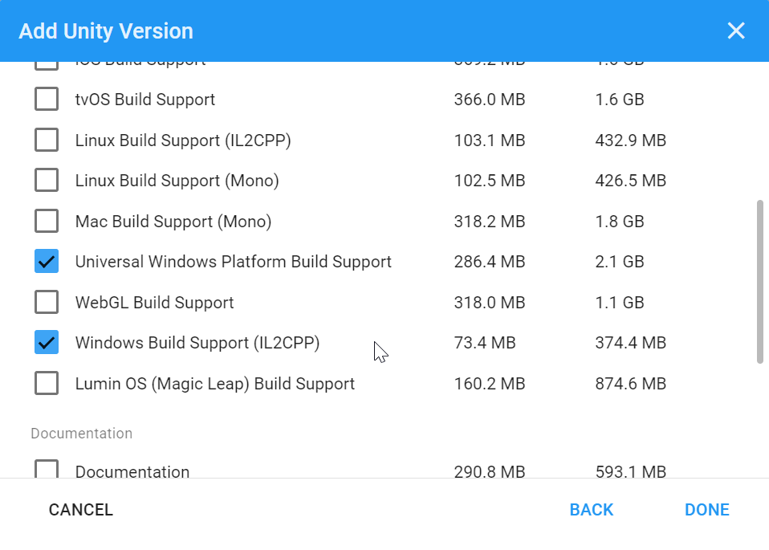
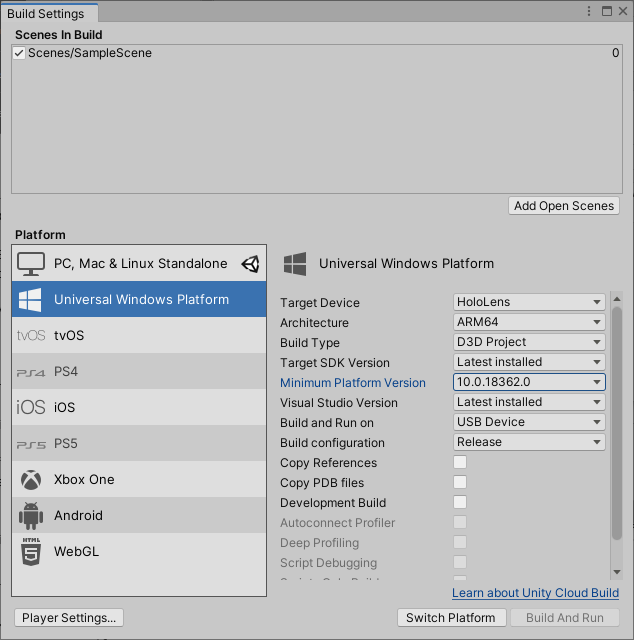
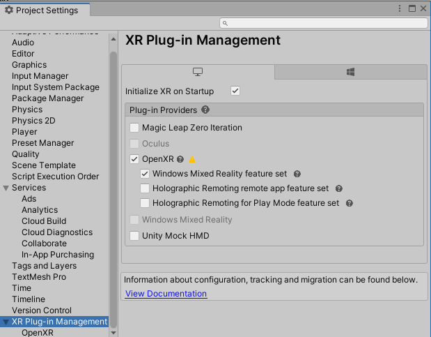

# Generate an SSH key pair
If you do not have an existing SSH key pair, generate a new one.

1. Open a terminal
2. Type `ssh-keygen -t ed25519 -C "your email here"`
3. Press enter to all the following prompts (i.e. leave them empty)

After the key was generated go to `C:\Users\USER\.ssh`, open `id_ed25519.pub` file and copy the content into `GitLab`.

Finally, you can pull the code using the default git command: 
```bash
git pull git@gitlab.ewi.tudelft.nl:IN4302TU/2021-2022/bsg-03.git
```

# Unity Version
The unity version we are using is `Unity 2020.3.22f1 (LTS)`.

The best way to install and manage Unity is through the **Unity Hub**:

1. Install [Unity Hub](https://unity3d.com/get-unity/download)
2. Select the **Installs** tab and choose **Add**
3. Select `Unity 2020.3.22f1 (LTS)` and click Next
4. Check the following components under `Platforms`:
   - Universal Windows Platform Build Support
   - Windows Build Support (IL2CPP)
  


# Hololense Emulator
Microsoft recommends using their [emulator](https://go.microsoft.com/fwlink/?linkid=2179936) in case no headset is present when testing. The emulator lets you run applications on a HoloLens virtual machine image without a physical HoloLens.


# Unity and GitLab
In order to make sure that Unity works with a version control platform like GitLab we need to execute the following steps:

1. Inside Unity, go to `Edit` &#8594; `Project Settings`
2. Open the `Version Control` tab on the left an make sure that the `Mode` is set to **Visible Meta Files**
3. Lastly, go to the `Editor` tab on the left and then to the `Asset Serialization` section. Make sure that the `Mode` is set to **Force Text**

# Setting up XR configuration
## Setting up the build target
Because this app is developed for `Hololense 2` the following build settings should be present:

1. Select `File` &#8594; `Build Settings...`
2. Select **Universal Windows Platform** in the Platform list and select **Switch Platform**
3. Set Architecture to **ARM64**
4. Set **Target device** to **HoloLens**
5. Set **Build Type** to **D3D Project**
6. Set **Target SDK Version** to **Latest installed**



## Configuring XR Plugin Management for OpenXR

To set OpenXR as the the runtime in Unity:

1. In the Unity Editor, navigate to `Edit` &#8594; `Project Settings`
2. In the list of Settings, select **XR Plugin Management** (should already be installed if you installed the Mixed Reality OpenXR plugin using MRFT)
3. Check the **Initialize XR on Startup** box
4. If targeting Desktop VR, stay on the PC Standalone tab (the monitor) and check the **OpenXR** and **Windows Mixed Reality feature set** boxes
5. Switch to the Universal Windows Platform tab (the Windows logo) and select the **OpenXR** and **Microsoft HoloLens feature set** boxes
   


If you see a yellow warning icon next to **OpenXR Plugin**, click the icon and select **Fix All** before continuing. The Unity Editor may need to restart itself for the changes to take effect.

## Optimization
Select the `Mixed Reality` &#8594; `Project` &#8594; `Apply recommended project settings for HoloLens 2` menu item to get better app performance.