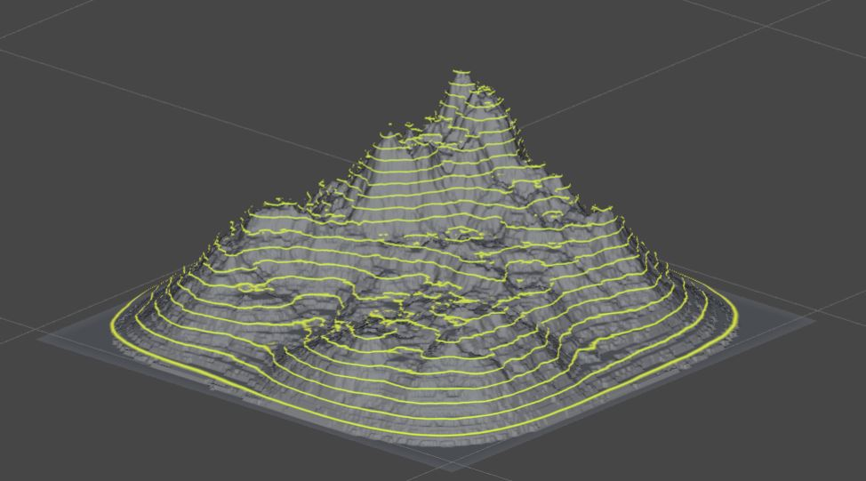
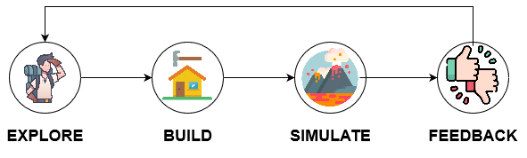

# Mathisfactory: An Augmented Reality Game for Reinforcing Mathematical Intuition in Earth Sciences

   
   
    
   
   

## Table of Contents
- [Mathisfactory: An Augmented Reality Game for Reinforcing Mathematical Intuition in Earth Sciences](#mathisfactory-an-augmented-reality-game-for-reinforcing-mathematical-intuition-in-earth-sciences)
  - [Table of Contents](#table-of-contents)
  - [Overview](#overview)
  - [Gameplay](#gameplay)
    - [Planning Phase](#planning-phase)
    - [Simulation Phase](#simulation-phase)
  - [Evaluation](#evaluation)
    - [Limitations](#limitations)
    - [Future Work](#future-work)

## Overview

Mathisfactory is an Augmented Reality (AR) serious game designed to enhance students' understanding of abstract mathematical concepts such as level curves and directional derivatives. By utilizing AR technology, the game provides an interactive and immersive learning experience for students, bridging the gap between theoretical knowledge and real-world application. The game is set in a geological context, with players analyzing and predicting lava flow in a volcanic situation using their understanding of level curves and directional derivatives.

## Gameplay

  

Mathisfactory is centered around a physical volcano model, with AR mechanics overlaying mathematical concepts on the model. The game consists of five levels of increasing difficulty, with each level requiring players to place research-oriented buildings on the volcano's surface in the safest locations possible. The game is divided into two phases: the Planning phase and the Simulation phase.

### Planning Phase

During the Planning phase, players use AR tools to analyze the terrain, visualize level curves, and probe possible locations for their directional derivatives. The goal is to determine the safest locations for placing buildings on the volcano surface. The player can explore any potential building location on the volcano surface without any time constraints.

### Simulation Phase

In the Simulation phase, an AR-based lava flow simulation is displayed over the physical volcano model. The lava flow interacts with the placed buildings, and players receive feedback on the success of their predictions. Players can rewind and pause the lava flow simulation to analyze their predictions and investigate any discrepancies. The final score is determined by the number of buildings affected by the lava flow and the height at which they were placed.

## Evaluation

Mathisfactory was evaluated through multiple play sessions with 12 freshman college students. After playing the game, students filled out a survey to provide feedback on their experience and the extent to which AR enhanced their understanding of the mathematical concepts. The majority of students found the game helpful in understanding level curves and their relation to a 3D volume, and reported the interactivity to be engaging and helpful.

### Limitations

The current evaluation has limitations, such as a limited playtesting sample size and focusing exclusively on freshman students of the Earth Sciences faculty. Additionally, technical limitations of the Microsoft HoloLens 2 used for the AR interactions affect the overall experience. As the technology behind the HoloLens develops, we expect a better experience for players of Mathisfactory.

### Future Work

Possible future work includes conducting a broader evaluation effort to better identify the specific topics the game is applicable to and the age group that benefits the most from the AR-based mechanics. Furthermore, improvements to the AR interactions, such as better visualization of directional derivatives and more intuitive game menus, can be explored as the technology behind the HoloLens develops.
